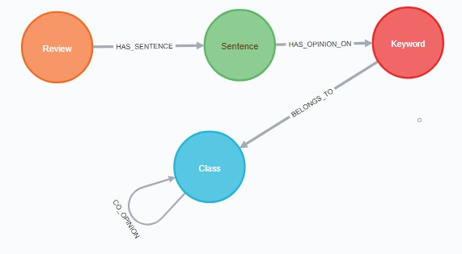

# NEO4J+NLP for analysing customer feedback.
## GBCFA=Graph-Based Customer Feedback Analysis
Beyond simple sentiment classification and tallying, product design experts require a way to interrogate a corpus of customer feedback in a manner akin to conducting an interview. This work places emphasis on analysis to provide a solution that grants more flexibility to product design experts as they examine customer feedback. Previous research have approached the problem of applying opinion to product by emphasizing on sentiment classification whiles reducing the “analysis” component in sentiment analysis to simple product aspect opinion tallies.




1.	Nodes: review, sentence, keyword, aspect class 
2.	Relationships: 
  *	(Review)-[:HAS_SENTENCE]->(Sentence)
  *	(Sentence)-[:HAS_OPINION_ON]->(Keword)
  *	(Keyword)-[:BELONGS_TO]->(Class) : Example, the BATTERY aspect class can consist of the following Keywords --.	```BATTERY=["battery","recharging","battries", "recharge","power unit", "power_unit", "electric”, cell","electric_cell","cell","cells", "electric_battery","power cell"]```
3. (Class)-[:CO_OPINION]->(Class) : This implies two classes have been mentioned together in a comment/review/statement. Example--"The wifi speed is great but the screen is not bright enough."
